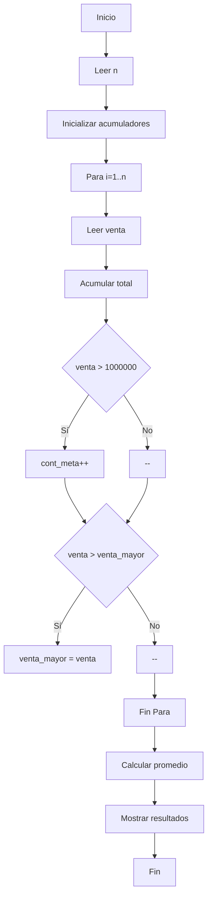
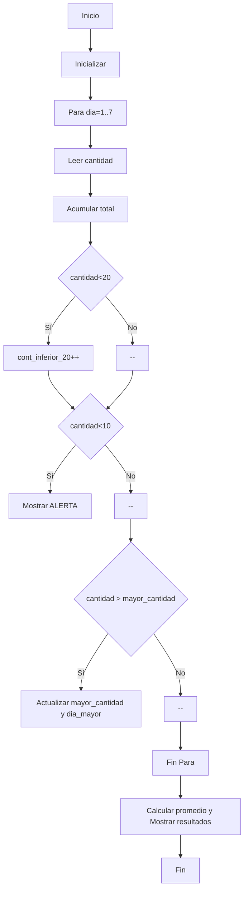
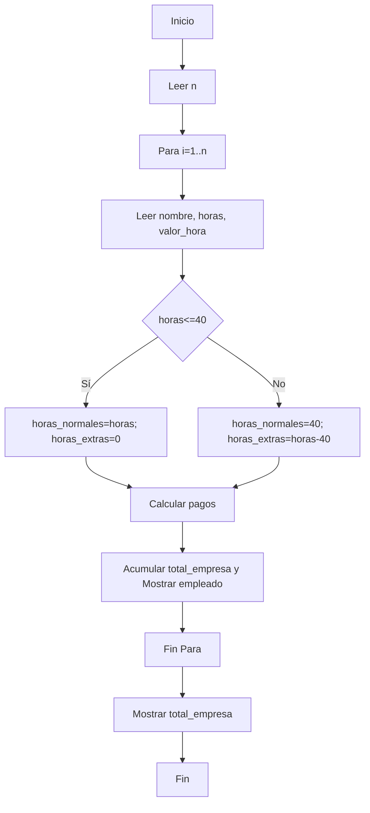
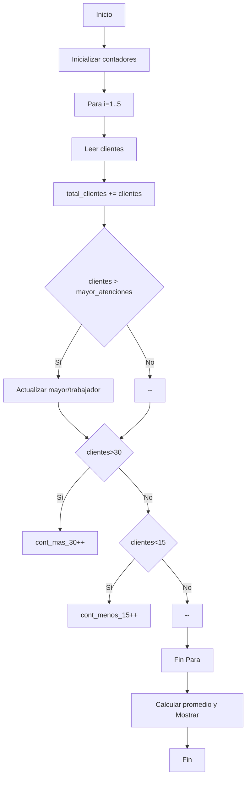
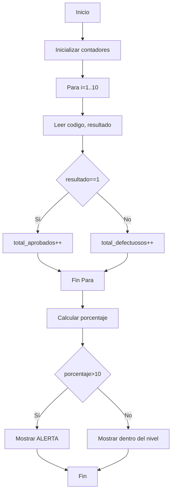
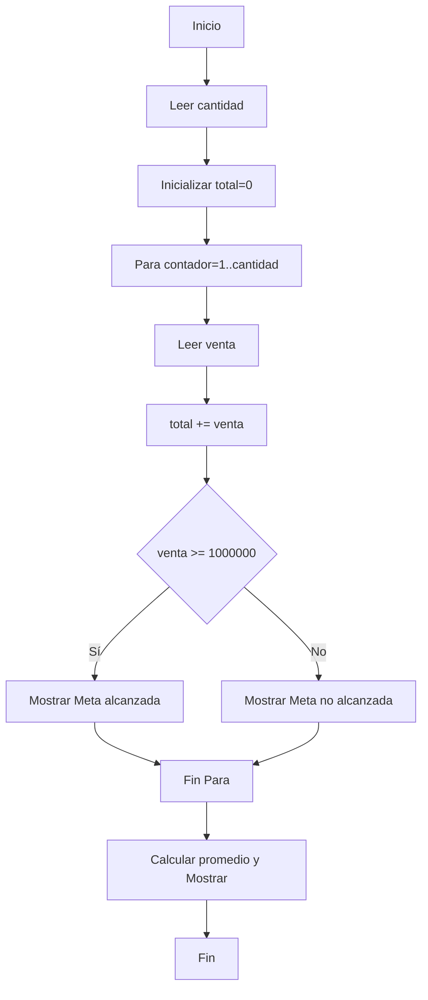

# Casos de Estudio - Parcial

Repositorio oficial que contiene la solución estructurada y completa de los casos de estudio y talleres prácticos requeridos para el primer parcial. Cada caso se encuentra organizado en su respectiva carpeta e incluye:
* **Análisis detallado** (Entradas, Procesos, Salidas, Variables).
* **Pseudocódigo estructurado**.
* **Diagramas lógicos / de flujo**.
* **Código fuente en Python** (`.py`).
* **Pruebas de escritorio** con datos de prueba reales.

---

## 📂 Índice de Casos de Estudio

### 1. [Caso de estudio 1: Control de ventas](./caso_1_control_ventas/)
* **Descripción:** Algoritmo para solicitar el número de empleados y sus ventas semanales, calculando el total, promedio, cantidad de empleados que superan la meta de $1.000.000 y la venta más alta.
* **Archivos:** [`README.md`](./caso_1_control_ventas/README.md) | [`control_ventas.py`](./caso_1_control_ventas/control_ventas.py)

### 2. [Caso de estudio 2: Control de inventario](./caso_2_control_inventario/)
* **Descripción:** Control de existencias de un producto durante 7 días, calculando total, promedio, día con mayor stock, conteo de días con inventario inferior a 20 unidades y alertas para inventarios menores a 10 unidades.
* **Archivos:** [`README.md`](./caso_2_control_inventario/README.md) | [`control_inventario.py`](./caso_2_control_inventario/control_inventario.py)

### 3. [Caso de estudio 3: Nómina de empleados](./caso_3_nomina_empleados/)
* **Descripción:** Cálculo de salario semanal para varios empleados, considerando horas normales y horas extras (con un recargo del 25% si superan las 40 horas), mostrando desgloses individuales y el total pagado por la organización.
* **Archivos:** [`README.md`](./caso_3_nomina_empleados/README.md) | [`nomina_empleados.py`](./caso_3_nomina_empleados/nomina_empleados.py)

### 4. [Caso de estudio 4: Atención al cliente](./caso_4_atencion_cliente/)
* **Descripción:** Registro y análisis de atención al cliente de 5 trabajadores utilizando simultáneamente variables, estructuras condicionales `SI-SINO`, bucles `PARA`, contadores y acumuladores.
* **Archivos:** [`README.md`](./caso_4_atencion_cliente/README.md) | [`atencion_cliente.py`](./caso_4_atencion_cliente/atencion_cliente.py)

### 5. [Caso de estudio 5: Control de calidad](./caso_5_control_calidad/)
* **Descripción:** Inspección de 10 productos fabricados (1 = aprobado, 0 = defectuoso) determinando totales, porcentajes de defectos y generando alertas críticas si el porcentaje supera el 10%.
* **Archivos:** [`README.md`](./caso_5_control_calidad/README.md) | [`control_calidad.py`](./caso_5_control_calidad/control_calidad.py)

### 6. [Caso de estudio 6: Taller práctico de codificación](./caso_6_taller_practico/)
* **Descripción:** Conversión de pseudocódigo secuencial e iterativo a código Python ejecutable con validación de metas de ventas.
* **Archivos:** [`README.md`](./caso_6_taller_practico/README.md) | [`taller_practico.py`](./caso_6_taller_practico/taller_practico.py)

---

## 🚀 Instrucciones de Ejecución

Para ejecutar cualquiera de los scripts en Python desde la terminal:

```bash
python3 caso_1_control_ventas/control_ventas.py
python3 caso_2_control_inventario/control_inventario.py
python3 caso_3_nomina_empleados/nomina_empleados.py
python3 caso_4_atencion_cliente/atencion_cliente.py
python3 caso_5_control_calidad/control_calidad.py
python3 caso_6_taller_practico/taller_practico.py
```

---
*Fecha de entrega final (en físico y plataforma): **18 de Agosto**.*

# Caso 1 - Control de ventas

## A. Análisis
- Entradas: número de empleados, valor de ventas por empleado (numérico)
- Procesos: acumular ventas, contar empleados que superan meta, obtener venta máxima, calcular promedio
- Salidas: total de ventas, promedio, cantidad que superó meta, venta más alta
- Variables: `n`, `venta`, `total_ventas`, `promedio`, `cont_meta`, `venta_mayor`

## B. Pseudocódigo
```text
Inicio
    Leer n
    total_ventas = 0
    cont_meta = 0
    venta_mayor = 0

    Para i = 1 Hasta n Hacer
        Leer venta
        total_ventas = total_ventas + venta

        Si venta > 1000000 Entonces
            cont_meta = cont_meta + 1
        FinSi

        Si i == 1 O venta > venta_mayor Entonces
            venta_mayor = venta
        FinSi
    FinPara

    promedio = total_ventas / n
    Mostrar total_ventas, promedio, cont_meta, venta_mayor
Fin
```

## C. Diagrama de flujo (Mermaid)


## D. Código
```python
CYAN = "\033[96m"
GREEN = "\033[92m"
YELLOW = "\033[93m"
BLUE = "\033[94m"
BOLD = "\033[1m"
RESET = "\033[0m"

print(f"{CYAN}{'=' * 50}{RESET}")
print(f"{BOLD}{BLUE}       SISTEMA DE CONTROL DE VENTAS SEMANAL       {RESET}")
print(f"{CYAN}{'=' * 50}{RESET}\n")

n = int(input(f"{YELLOW}Ingrese el número de empleados a procesar: {RESET}"))
print(f"{CYAN}{'-' * 50}{RESET}")

total_ventas = 0.0
cont_meta = 0
venta_mayor = 0.0

for i in range(1, n + 1):
    venta = float(input(f"{YELLOW}Ingrese el valor de las ventas del empleado {i}: ${RESET}"))
    
    total_ventas = total_ventas + venta
    
    if venta > 1000000:
        cont_meta = cont_meta + 1
        print(f"  {GREEN}✔ ¡Meta superada ($1.000.000)!{RESET}")
        
    if i == 1 or venta > venta_mayor:
        venta_mayor = venta

if n > 0:
    promedio = total_ventas / n
else:
    promedio = 0.0

print(f"\n{CYAN}{'=' * 50}{RESET}")
print(f"{BOLD}{BLUE}           RESULTADOS FINALES DE VENTAS           {RESET}")
print(f"{CYAN}{'=' * 50}{RESET}")
print(f" Total de ventas            : {GREEN}${total_ventas:,.2f}{RESET}")
print(f" Promedio de ventas         : {GREEN}${promedio:,.2f}{RESET}")
print(f" Empleados que superan meta : {YELLOW}{cont_meta}{RESET}")
print(f" Venta más alta             : {GREEN}${venta_mayor:,.2f}{RESET}")
print(f"{CYAN}{'=' * 50}{RESET}")
```

## E. Prueba de escritorio (5 empleados)
- Datos: 850000, 1200000, 950000, 1500000, 1100000
- Total = 5.600.000
- Promedio = 1.120.000
- Empleados que superan $1.000.000 = 3
- Venta más alta = 1.500.000

# Caso 2 - Control de inventario

## Análisis
- Problema: controlar existencias por 7 días y detectar días con bajo stock
- Entradas: cantidad diaria (7 valores)
- Procesos: registrar cantidades, acumular total, contar días <20, detectar alertas <10, encontrar día con mayor cantidad
- Salidas: total unidades, promedio, día con mayor cantidad, conteo días <20, alertas
- Variables: `cantidad`, `total_unidades`, `promedio`, `cont_inferior_20`, `mayor_cantidad`, `dia_mayor`

## Pseudocódigo (PARA)
```text
Inicio
    total_unidades = 0
    cont_inferior_20 = 0
    mayor_cantidad = 0

    Para dia = 1 Hasta 7 Hacer
        Leer cantidad
        total_unidades = total_unidades + cantidad

        Si cantidad < 20 Entonces
            cont_inferior_20 = cont_inferior_20 + 1
        FinSi

        Si dia == 1 O cantidad > mayor_cantidad Entonces
            mayor_cantidad = cantidad
            dia_mayor = dia
        FinSi

        Si cantidad < 10 Entonces
            Mostrar "ALERTA"
        FinSi
    FinPara

    promedio = total_unidades / 7
    Mostrar total_unidades, promedio, dia_mayor, cont_inferior_20
Fin
```

## Diagrama de flujo (Mermaid)


## Prueba de escritorio
- Datos: 15, 35, 8, 25, 12, 7, 40
- Total = 142
- Promedio ≈ 20.29
- Día con mayor cantidad = Día 7 (40)
- Días con inventario <20 = 4
- Alertas en días con 8 y 7 unidades

## Código
```python
CYAN = "\033[96m"
GREEN = "\033[92m"
YELLOW = "\033[93m"
RED = "\033[91m"
BLUE = "\033[94m"
BOLD = "\033[1m"
RESET = "\033[0m"

print(f"{CYAN}{'=' * 50}{RESET}")
print(f"{BOLD}{BLUE}      SISTEMA DE CONTROL DE INVENTARIO (7 DÍAS)   {RESET}")
print(f"{CYAN}{'=' * 50}{RESET}\n")

total_unidades = 0
cont_inferior_20 = 0
mayor_cantidad = 0
dia_mayor = 0

for dia in range(1, 8):
    cantidad = int(input(f"{YELLOW}Ingrese la cantidad de productos disponibles el día {dia}: {RESET}"))
    
    total_unidades = total_unidades + cantidad
    
    if dia == 1 or cantidad > mayor_cantidad:
        mayor_cantidad = cantidad
        dia_mayor = dia
        
    if cantidad < 20:
        cont_inferior_20 = cont_inferior_20 + 1
        
    if cantidad < 10:
        print(f" {RED}>> ALERTA: Stock crítico el día {dia} ({cantidad} unidades){RESET}")

promedio = total_unidades / 7

print(f"\n{CYAN}{'=' * 50}{RESET}")
print(f"{BOLD}{BLUE}           INFORME DE CONTROL DE INVENTARIO       {RESET}")
print(f"{CYAN}{'=' * 50}{RESET}")
print(f" Total de unidades registradas    : {GREEN}{total_unidades}{RESET}")
print(f" Promedio de unidades por día     : {GREEN}{promedio:,.2f}{RESET}")
print(f" Día con mayor stock              : {GREEN}Día {dia_mayor} ({mayor_cantidad} unidades){RESET}")
print(f" Días con inventario menor a 20   : {YELLOW}{cont_inferior_20}{RESET}")
print(f"{CYAN}{'=' * 50}{RESET}")
```

# Caso 3 - Nómina de empleados

## Análisis
- Entradas: nombre, horas trabajadas, valor hora para cada empleado
- Procesos: calcular horas normales (hasta 40) y horas extras (>40) con recargo 25%, calcular salario normal, pago horas extras y salario total; acumular total pagado por la empresa
- Salidas: salario normal, pago horas extras, salario total por empleado y total pagado por la empresa
- Variables: `nombre`, `horas_trabajadas`, `valor_hora`, `horas_normales`, `horas_extras`, `salario_normal`, `pago_extras`, `salario_total`, `total_empresa`

## Pseudocódigo
```text
Inicio
    Leer n
    total_empresa = 0

    Para i = 1 Hasta n Hacer
        Leer nombre, horas_trabajadas, valor_hora

        Si horas_trabajadas <= 40 Entonces
            horas_normales = horas_trabajadas
            horas_extras = 0
        Sino
            horas_normales = 40
            horas_extras = horas_trabajadas - 40
        FinSi

        salario_normal = horas_normales * valor_hora
        pago_extras = horas_extras * (valor_hora * 1.25)
        salario_total = salario_normal + pago_extras
        total_empresa = total_empresa + salario_total

        Mostrar resultados del empleado
    FinPara

    Mostrar total_empresa
Fin
```

## Diagrama de flujo (Mermaid)


## Prueba de escritorio (Ejemplo Ana)
- Horas: 45, Valor hora: 10000
- Horas normales = 40
- Horas extras = 5
- Pago horas normales = 400000
- Pago horas extras = 62500
- Salario total = 462500

## Código
```python
CYAN = "\033[96m"
GREEN = "\033[92m"
YELLOW = "\033[93m"
RED = "\033[91m"
BLUE = "\033[94m"
BOLD = "\033[1m"
RESET = "\033[0m"

print(f"{CYAN}{'=' * 50}{RESET}")
print(f"{BOLD}{BLUE}          SISTEMA DE NÓMINA DE EMPLEADOS          {RESET}")
print(f"{CYAN}{'=' * 50}{RESET}\n")

n = int(input(f"{YELLOW}Ingrese el número de empleados a procesar: {RESET}"))

total_empresa = 0.0

for i in range(1, n + 1):
    print(f"\n{CYAN}{'-' * 50}{RESET}")
    print(f"{BOLD}{BLUE}               DATOS DEL EMPLEADO {i}             {RESET}")
    print(f"{CYAN}{'-' * 50}{RESET}")
    nombre = input(f"{YELLOW} Nombre del empleado : {RESET}")
    horas_trabajadas = float(input(f"{YELLOW} Horas trabajadas    : {RESET}"))
    valor_hora = float(input(f"{YELLOW} Valor de la hora ($): {RESET}"))
    
    if horas_trabajadas <= 40:
        horas_normales = horas_trabajadas
        horas_extras = 0.0
    else:
        horas_normales = 40.0
        horas_extras = horas_trabajadas - 40.0
        
    salario_normal = horas_normales * valor_hora
    pago_extras = horas_extras * (valor_hora * 1.25)
    salario_total = salario_normal + pago_extras
    
    total_empresa = total_empresa + salario_total
    
    print(f"\n{CYAN}{'-' * 50}{RESET}")
    print(f"{BOLD}{GREEN}       REPORTE SALARIAL: {nombre.upper()}       {RESET}")
    print(f"{CYAN}{'-' * 50}{RESET}")
    print(f" Horas normales trabajadas : {horas_normales}")
    print(f" Horas extras realizadas   : {YELLOW}{horas_extras}{RESET}")
    print(f" Pago por horas normales   : ${salario_normal:,.2f}")
    print(f" Pago por horas extras     : ${pago_extras:,.2f}")
    print(f" Salario total a pagar     : {GREEN}${salario_total:,.2f}{RESET}")
    print(f"{CYAN}{'-' * 50}{RESET}")

print(f"\n{CYAN}{'=' * 50}{RESET}")
print(f"{BOLD}{BLUE}              RESUMEN FINANCIERO EMPRESA          {RESET}")
print(f"{CYAN}{'=' * 50}{RESET}")
print(f" Total pagado por la empresa : {GREEN}${total_empresa:,.2f}{RESET}")
print(f"{CYAN}{'=' * 50}{RESET}")
```

# Caso 4 - Atención al cliente

## Análisis
- Entradas: cantidad de clientes atendidos por 5 trabajadores
- Procesos: acumular total, calcular promedio, identificar trabajador con mayor atenciones, contar >30 y <15
- Salidas: total clientes, promedio, trabajador con mayor atención, conteos >30 y <15
- Variables: `clientes`, `total_clientes`, `mayor_atenciones`, `trabajador_estrella`, `cont_mas_30`, `cont_menos_15`

## Pseudocódigo
```text
Inicio
    total_clientes = 0

    Para i = 1 Hasta 5 Hacer
        Leer clientes
        total_clientes = total_clientes + clientes

        Si i == 1 O clientes > mayor_atenciones Entonces
            actualizar mayor y trabajador_estrella
        FinSi

        Si clientes > 30 Entonces
            cont_mas_30 = cont_mas_30 + 1
        SinoSi clientes < 15 Entonces
            cont_menos_15 = cont_menos_15 + 1
        FinSi
    FinPara

    promedio = total_clientes / 5
    Mostrar resultados
Fin
```

## Diagrama de flujo (Mermaid)


## Código
```python
CYAN = "\033[96m"
GREEN = "\033[92m"
YELLOW = "\033[93m"
RED = "\033[91m"
BLUE = "\033[94m"
BOLD = "\033[1m"
RESET = "\033[0m"

print(f"{CYAN}{'=' * 50}{RESET}")
print(f"{BOLD}{BLUE}     SISTEMA DE CONTROL DE ATENCIÓN AL CLIENTE    {RESET}")
print(f"{CYAN}{'=' * 50}{RESET}\n")

total_clientes = 0
mayor_atenciones = 0
trabajador_estrella = 1
cont_mas_30 = 0
cont_menos_15 = 0

for i in range(1, 6):
    clientes = int(input(f"{YELLOW}Ingrese la cantidad de clientes atendidos por el Trabajador {i}: {RESET}"))
    
    total_clientes = total_clientes + clientes
    
    if i == 1 or clientes > mayor_atenciones:
        mayor_atenciones = clientes
        trabajador_estrella = i
        
    if clientes > 30:
        cont_mas_30 = cont_mas_30 + 1
    elif clientes < 15:
        cont_menos_15 = cont_menos_15 + 1
        
promedio = total_clientes / 5

print(f"\n{CYAN}{'=' * 50}{RESET}")
print(f"{BOLD}{BLUE}       REPORTE DE ATENCIÓN AL CLIENTE        {RESET}")
print(f"{CYAN}{'=' * 50}{RESET}")
print(f" Total de clientes atendidos         : {GREEN}{total_clientes}{RESET}")
print(f" Promedio de atenciones por trabajador: {GREEN}{promedio:,.2f}{RESET}")
print(f" Trabajador con mayor atención       : {GREEN}Trabajador {trabajador_estrella} ({mayor_atenciones} clientes){RESET}")
print(f" Trabajadores con > 30 clientes      : {YELLOW}{cont_mas_30}{RESET}")
print(f" Trabajadores con < 15 clientes      : {RED}{cont_menos_15}{RESET}")
print(f"{CYAN}{'=' * 50}{RESET}")
```

# Caso 5 - Control de calidad

## Análisis
- Entradas: código del producto y resultado de inspección (1=aprobado, 0=defectuoso) para 10 productos
- Procesos: contar aprobados y defectuosos, calcular porcentaje de defectuosos y evaluar alerta si >10%
- Salidas: total inspeccionados, aprobados, defectuosos, porcentaje, mensaje de alerta o normal
- Variables: `codigo`, `resultado`, `total_aprobados`, `total_defectuosos`, `total_inspeccionados`, `porcentaje_defectuosos`

## Pseudocódigo
```text
Inicio
    total_aprobados = 0
    total_defectuosos = 0

    Para i = 1 Hasta 10 Hacer
        Leer codigo, resultado

        Si resultado == 1 Entonces
            total_aprobados = total_aprobados + 1
        Sino
            total_defectuosos = total_defectuosos + 1
        FinSi
    FinPara

    porcentaje_defectuosos = (total_defectuosos / 10) * 100

    Si porcentaje_defectuosos > 10 Entonces
        Mostrar "ALERTA"
    Sino
        Mostrar "Proceso dentro del nivel permitido"
    FinSi
Fin
```

## Diagrama de flujo (Mermaid)


## Código
```python
CYAN = "\033[96m"
GREEN = "\033[92m"
YELLOW = "\033[93m"
RED = "\033[91m"
BLUE = "\033[94m"
BOLD = "\033[1m"
RESET = "\033[0m"

print(f"{CYAN}{'=' * 50}{RESET}")
print(f"{BOLD}{BLUE}          SISTEMA DE CONTROL DE CALIDAD           {RESET}")
print(f"{CYAN}{'=' * 50}{RESET}\n")

total_aprobados = 0
total_defectuosos = 0
total_inspeccionados = 10

for i in range(1, total_inspeccionados + 1):
    print(f"{CYAN}{'-' * 50}{RESET}")
    print(f"{BOLD} Inspección Producto {i} de {total_inspeccionados}{RESET}")
    print(f"{CYAN}{'-' * 50}{RESET}")
    codigo = input(f"{YELLOW} Código del producto : {RESET}")
    resultado = int(input(f"{YELLOW} Resultado (1=Aprobado, 0=Defectuoso): {RESET}"))
            
    if resultado == 1:
        total_aprobados = total_aprobados + 1
        print(f"  {GREEN}✔ Producto Aprobado{RESET}")
    else:
        total_defectuosos = total_defectuosos + 1
        print(f"  {RED}✖ Producto Defectuoso{RESET}")
        
porcentaje_defectuosos = (total_defectuosos / total_inspeccionados) * 100.0

print(f"\n{CYAN}{'=' * 50}{RESET}")
print(f"{BOLD}{BLUE}       INFORME FINAL DE CONTROL DE CALIDAD        {RESET}")
print(f"{CYAN}{'=' * 50}{RESET}")
print(f" Total de productos inspeccionados : {total_inspeccionados}")
print(f" Total de productos aprobados      : {GREEN}{total_aprobados}{RESET}")
print(f" Total de productos defectuosos    : {RED}{total_defectuosos}{RESET}")
print(f" Porcentaje de defectuosos         : {YELLOW}{porcentaje_defectuosos:.2f}%{RESET}")
print(f"{CYAN}{'-' * 50}{RESET}")

if porcentaje_defectuosos > 10:
    print(f" {RED}>> ALERTA: Revisar proceso de producción{RESET}")
else:
    print(f" {GREEN}>> PROCESO: Dentro del nivel permitido{RESET}")
print(f"{CYAN}{'=' * 50}{RESET}")
```

# Caso 6 - Taller práctico

## Conversión del pseudocódigo
El pseudocódigo proporcionado fue convertido a Python en `taller_practico.py`.

## Pseudocódigo (original)
```text
Inicio
    Leer cantidad
    total = 0

    Para contador = 1 Hasta cantidad Hacer
        Leer venta
        total = total + venta

        Si venta >= 1000000 Entonces
            Mostrar "Meta alcanzada"
        Sino
            Mostrar "Meta no alcanzada"
        FinSi
    FinPara

    promedio = total / cantidad
    Mostrar total, promedio
Fin
```

## Diagrama de flujo (Mermaid)


## Código
```python
CYAN = "\033[96m"
GREEN = "\033[92m"
YELLOW = "\033[93m"
RED = "\033[91m"
BLUE = "\033[94m"
BOLD = "\033[1m"
RESET = "\033[0m"

print(f"{CYAN}{'=' * 50}{RESET}")
print(f"{BOLD}{BLUE}         TALLER PRÁCTICO DE CODIFICACIÓN          {RESET}")
print(f"{CYAN}{'=' * 50}{RESET}\n")

cantidad = int(input(f"{YELLOW}Ingrese la cantidad de ventas a procesar: {RESET}"))
print(f"{CYAN}{'-' * 50}{RESET}")

total = 0.0

for contador in range(1, cantidad + 1):
    venta = float(input(f"{YELLOW}Ingrese la venta {contador}: ${RESET}"))
    total = total + venta
    
    if venta >= 1000000:
        print(f"  {GREEN}-> Meta alcanzada{RESET}")
    else:
        print(f"  {YELLOW}-> Meta no alcanzada{RESET}")
        
if cantidad > 0:
    promedio = total / cantidad
else:
    promedio = 0.0

print(f"\n{CYAN}{'=' * 50}{RESET}")
print(f"{BOLD}{BLUE}             RESULTADOS FINALES                   {RESET}")
print(f"{CYAN}{'=' * 50}{RESET}")
print(f" Total general de ventas : {GREEN}${total:,.2f}{RESET}")
print(f" Promedio de ventas      : {GREEN}${promedio:,.2f}{RESET}")
print(f"{CYAN}{'=' * 50}{RESET}")
```

