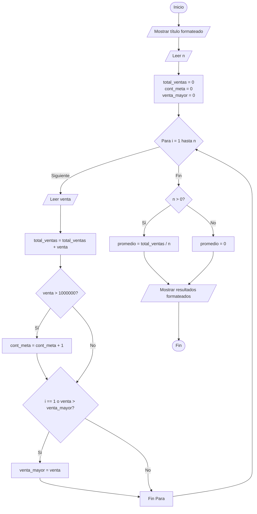

# Caso de estudio 1: Control de ventas

> Algoritmo para solicitar el número de empleados y sus ventas semanales, calculando el total, promedio, cantidad de empleados que superan la meta de $1.000.000 y la venta más alta, con una interfaz de consola optimizada.

## Actividad A: Identificación

| Elemento | Descripción |
| :--- | :--- |
| **Entradas** | `n` (número total de empleados) y `venta` (valor de las ventas de cada empleado). |
| **Procesos** | - Solicitar el número de empleados (`n`).<br>- Iterar `n` veces para solicitar la venta de cada empleado.<br>- Acumular el total de ventas (`total_ventas = total_ventas + venta`).<br>- Calcular el promedio de ventas (`promedio = total_ventas / n`).<br>- Contar cuántos empleados superan la meta de $1.000.000.<br>- Determinar la venta más alta comparando con la mayor registrada. |
| **Salidas** | Total de ventas, promedio de ventas, cantidad de empleados que superaron la meta y la venta más alta registrada. |
| **Variables** | `n` (int), `i` (int), `venta` (float), `total_ventas` (float), `promedio` (float), `cont_meta` (int), `venta_mayor` (float). |

---

## Actividad B: Pseudocódigo

```text
Inicio
    // 1. Solicitar número de empleados
    Escribir "=================================================="
    Escribir "       SISTEMA DE CONTROL DE VENTAS SEMANAL       "
    Escribir "=================================================="
    Escribir "Ingrese el número de empleados a procesar:"
    Leer n
    
    // Inicializar variables
    total_ventas = 0
    cont_meta = 0
    venta_mayor = 0
    
    // 2. Ciclo para cada empleado
    Para i = 1 Hasta n Hacer
        Escribir "Ingrese el valor de las ventas del empleado ", i, ":"
        Leer venta
        
        // 3. Acumular total de ventas
        total_ventas = total_ventas + venta
        
        // 4. Determinar empleados que superan la meta de $1.000.000
        Si venta > 1000000 Entonces
            cont_meta = cont_meta + 1
        FinSi
        
        // 5. Determinar la venta más alta
        Si i == 1 O venta > venta_mayor Entonces
            venta_mayor = venta
        FinSi
    FinPara
    
    // 6. Calcular promedio de ventas
    Si n > 0 Entonces
        promedio = total_ventas / n
    Sino
        promedio = 0
    FinSi
    
    // 7. Mostrar resultados
    Escribir "=================================================="
    Escribir "           RESULTADOS FINALES DE VENTAS           "
    Escribir "=================================================="
    Escribir " Total de ventas            : $", total_ventas
    Escribir " Promedio de ventas         : $", promedio
    Escribir " Empleados que superan meta : ", cont_meta
    Escribir " Venta más alta             : $", venta_mayor
    Escribir "=================================================="
Fin
```

---

## Actividad C: Diagrama de Flujo



---

## Actividad D: Código en Python (UI Mejorada)

```python
print("==================================================")
print("       SISTEMA DE CONTROL DE VENTAS SEMANAL       ")
print("==================================================\n")

n = int(input("Ingrese el número de empleados a procesar: "))
print("-" * 50)

total_ventas = 0.0
cont_meta = 0
venta_mayor = 0.0

for i in range(1, n + 1):
    venta = float(input(f"Ingrese el valor de las ventas del empleado {i}: $"))
    
    # Acumular total de ventas
    total_ventas = total_ventas + venta
    
    # Determinar empleados que superan la meta de $1.000.000
    if venta > 1000000:
        cont_meta = cont_meta + 1
        
    # Determinar la venta más alta
    if i == 1 or venta > venta_mayor:
        venta_mayor = venta
        
# Calcular promedio
if n > 0:
    promedio = total_ventas / n
else:
    promedio = 0.0

# Mostrar resultados
print("\n" + "=" * 50)
print("           RESULTADOS FINALES DE VENTAS           ")
print("==================================================")
print(f" Total de ventas            : ${total_ventas}")
print(f" Promedio de ventas         : ${promedio}")
print(f" Empleados que superan meta : {cont_meta}")
print(f" Venta más alta             : ${venta_mayor}")
print("==================================================")
```

---

## Actividad E: Prueba de Escritorio

**Datos de prueba (5 Empleados):**
* Empleado 1: $850.000
* Empleado 2: $1.200.000
* Empleado 3: $950.000
* Empleado 4: $1.500.000
* Empleado 5: $1.100.000

| Iteración (`i`) | Venta Ingresada | `total_ventas` | ¿Venta > $1.000.000? (`cont_meta`) | ¿Venta > `venta_mayor`? (`venta_mayor`) |
| :---: | :---: | :---: | :---: | :---: |
| Inicial | - | 0 | 0 | 0 |
| 1 | $850.000 | 850.000 | No (0) | Sí (850.000) |
| 2 | $1.200.000 | 2.050.000 | Sí (1) | Sí (1.200.000) |
| 3 | $950.000 | 3.000.000 | No (1) | No (1.200.000) |
| 4 | $1.500.000 | 4.500.000 | Sí (2) | Sí (1.500.000) |
| 5 | $1.100.000 | 5.600.000 | Sí (3) | No (1.500.000) |

**Resultados Finales:**
* `total_ventas` = **$5.600.000**
* `promedio` = $5.600.000 / 5 = **$1.120.000**
* `cont_meta` = **3 empleados**
* `venta_mayor` = **$1.500.000**
