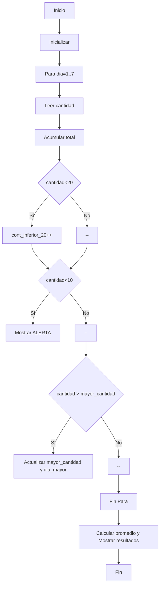

# Caso 2 - Control de inventario

## Análisis
- Problema: controlar existencias por 7 días y detectar días con bajo stock
- Entradas: cantidad diaria (7 valores)
- Procesos: registrar cantidades, acumular total, contar días <20, detectar alertas <10, encontrar día con mayor cantidad
- Salidas: total unidades, promedio, día con mayor cantidad, conteo días <20, alertas
- Variables: `cantidad`, `total_unidades`, `promedio`, `cont_inferior_20`, `mayor_cantidad`, `dia_mayor`

## Pseudocódigo (PARA)
Inicio
  total_unidades = 0
  cont_inferior_20 = 0
  mayor_cantidad = 0
  Para dia = 1 Hasta 7
    Leer cantidad
    total_unidades = total_unidades + cantidad
    Si cantidad < 20 Entonces cont_inferior_20 = cont_inferior_20 + 1 FinSi
    Si dia == 1 O cantidad > mayor_cantidad Entonces mayor_cantidad = cantidad; dia_mayor = dia FinSi
    Si cantidad < 10 Entonces Mostrar "ALERTA" FinSi
  FinPara
  promedio = total_unidades / 7
  Mostrar total_unidades, promedio, dia_mayor, cont_inferior_20
Fin

## Diagrama de flujo (Mermaid)


## Prueba de escritorio
- Datos: 15, 35, 8, 25, 12, 7, 40
- Total = 142
- Promedio ≈ 20.29
- Día con mayor cantidad = Día 7 (40)
- Días con inventario <20 = 4
- Alertas en días con 8 y 7 unidades

## Código
El código Python está en `control_inventario.py`.
# Caso de estudio 2: Control de inventario

> Control de existencias de un producto durante 7 días, calculando total, promedio, día con mayor stock, conteo de días con inventario inferior a 20 unidades y alertas para inventarios menores a 10 unidades, con consola optimizada.

## Actividad 1: Análisis

| Elemento | Descripción |
| :--- | :--- |
| **Problema** | Controlar las existencias de un producto durante 7 días, identificando mínimos críticos y promedios. |
| **Entradas** | Cantidad de productos disponibles por día (7 valores numéricos enteros). |
| **Procesos** | - Registrar la cantidad diaria de inventario durante 7 días.<br>- Acumular el total de unidades registradas.<br>- Calcular el promedio de unidades por día.<br>- Comparar cada cantidad para identificar el día con mayor stock.<br>- Contar los días con inventario menor a 20 unidades.<br>- Generar una alerta cuando el inventario sea menor de 10 unidades. |
| **Salidas** | Total de unidades, promedio, día con mayor cantidad, cantidad de días con menos de 20 unidades y alertas. |
| **Variables** | `dia` (int), `cantidad` (int), `total_unidades` (int), `promedio` (float), `dia_mayor` (int), `mayor_cantidad` (int), `cont_inferior_20` (int). |
| **Estructura selectiva** | Si-Entonces (evaluación de stock mayor, mínimo y alertas críticas). |
| **Estructura repetitiva** | Ciclo Para (iteración de los 7 días). |

---

## Actividad 2: Pseudocódigo

```text
Inicio
    Escribir "=================================================="
    Escribir "      SISTEMA DE CONTROL DE INVENTARIO (7 DÍAS)   "
    Escribir "=================================================="
    
    total_unidades = 0
    cont_inferior_20 = 0
    mayor_cantidad = 0
    dia_mayor = 0
    
    Para dia = 1 Hasta 7 Hacer
        Escribir "Ingrese la cantidad de productos disponibles el día ", dia, ":"
        Leer cantidad
        
        total_unidades = total_unidades + cantidad
        
        Si dia == 1 O cantidad > mayor_cantidad Entonces
            mayor_cantidad = cantidad
            dia_mayor = dia
        FinSi
        
        Si cantidad < 20 Entonces
            cont_inferior_20 = cont_inferior_20 + 1
        FinSi
        
        Si cantidad < 10 Entonces
            Escribir " >> ALERTA: Stock crítico el día ", dia, " (", cantidad, " unidades)"
        FinSi
    FinPara
    
    promedio = total_unidades / 7
    
    Escribir "=================================================="
    Escribir "           INFORME DE CONTROL DE INVENTARIO       "
    Escribir "=================================================="
    Escribir " Total de unidades registradas    : ", total_unidades
    Escribir " Promedio de unidades por día     : ", promedio
    Escribir " Día con mayor stock              : Día ", dia_mayor, " (", mayor_cantidad, " unidades)"
    Escribir " Días con inventario menor a 20   : ", cont_inferior_20
    Escribir "=================================================="
Fin
```

---

## Actividad 3: Código en Python (UI Mejorada)

```python
print("==================================================")
print("      SISTEMA DE CONTROL DE INVENTARIO (7 DÍAS)   ")
print("==================================================\n")

total_unidades = 0
cont_inferior_20 = 0
mayor_cantidad = 0
dia_mayor = 0

for dia in range(1, 8):
    cantidad = int(input(f"Ingrese la cantidad de productos disponibles el día {dia}: "))
    
    # Acumular total
    total_unidades = total_unidades + cantidad
    
    # Identificar día con mayor cantidad
    if dia == 1 or cantidad > mayor_cantidad:
        mayor_cantidad = cantidad
        dia_mayor = dia
        
    # Contar días con inventario inferior a 20
    if cantidad < 20:
        cont_inferior_20 = cont_inferior_20 + 1
        
    # Generar alerta si inventario < 10
    if cantidad < 10:
        print(f" >> ALERTA: Stock crítico el día {dia} ({cantidad} unidades)")
        
# Calcular promedio
promedio = total_unidades / 7

# Mostrar resultados
print("\n" + "=" * 50)
print("           INFORME DE CONTROL DE INVENTARIO       ")
print("==================================================")
print(f" Total de unidades registradas    : {total_unidades}")
print(f" Promedio de unidades por día     : {promedio}")
print(f" Día con mayor stock              : Día {dia_mayor} ({mayor_cantidad} unidades)")
print(f" Días con inventario menor a 20   : {cont_inferior_20}")
print("==================================================")
```

---

## Actividad 4: Prueba de Escritorio

**Datos de prueba:** `15, 35, 8, 25, 12, 7, 40`

| Día (`dia`) | Cantidad | `total_unidades` | ¿Mayor cantidad? (`mayor_cantidad`, `dia_mayor`) | ¿Cantidad < 20? (`cont_inferior_20`) | ¿Cantidad < 10? (Alerta) |
| :---: | :---: | :---: | :---: | :---: | :---: |
| 1 | 15 | 15 | Sí (15, Día 1) | Sí (1) | No |
| 2 | 35 | 50 | Sí (35, Día 2) | No (1) | No |
| 3 | 8 | 58 | No (35, Día 2) | Sí (2) | **ALERTA** |
| 4 | 25 | 83 | No (35, Día 2) | No (2) | No |
| 5 | 12 | 95 | No (35, Día 2) | Sí (3) | No |
| 6 | 7 | 102 | No (35, Día 2) | Sí (4) | **ALERTA** |
| 7 | 40 | 142 | Sí (40, Día 7) | No (4) | No |

**Resultados de la prueba:**
* Total de unidades registradas: **142**
* Promedio: **142 / 7 ≈ 20.29**
* Día con mayor cantidad: **Día 7** con **40** unidades.
* Días con inventario inferior a 20: **4 días**.
* Alertas emitidas: **Día 3** (8 unidades) y **Día 6** (7 unidades).
