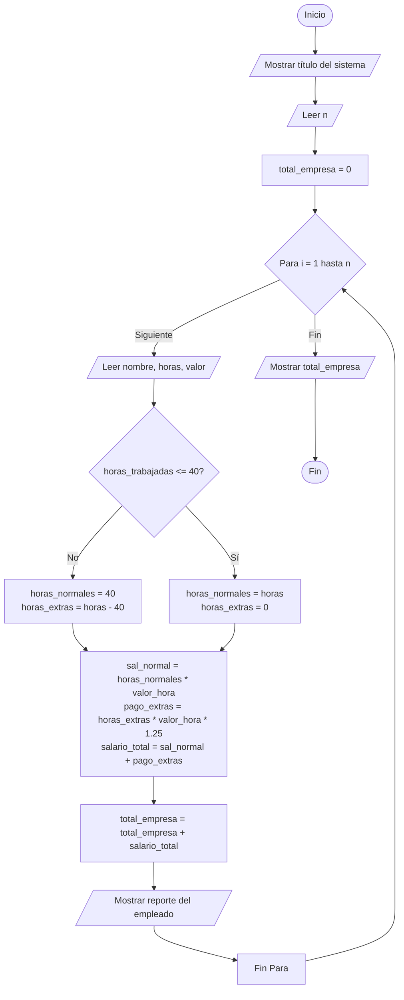

# Caso de estudio 3: Nómina de empleados

> Cálculo de salario semanal para varios empleados, considerando horas normales y horas extras (con un recargo del 25% si superan las 40 horas), mostrando desgloses individuales y el total pagado por la organización, con consola optimizada.

## 1. Análisis del problema

| Elemento | Descripción |
| :--- | :--- |
| **Problema** | Calcular el salario semanal de empleados incluyendo recargos por horas extras (sobre 40h) y el total pagado por la empresa. |
| **Entradas** | `n` (número de empleados). Por empleado: `nombre` (string), `horas_trabajadas` (float), `valor_hora` (float). |
| **Procesos** | - Iterar sobre los empleados.<br>- Si `horas_trabajadas > 40`, calcular extras (`horas_trabajadas - 40`) y normales (40).<br>- Si no, extras son 0 y normales son `horas_trabajadas`.<br>- Calcular pago normal (`horas_normales * valor_hora`).<br>- Calcular pago extra (`horas_extras * valor_hora * 1.25`).<br>- Calcular salario total y acumular en el pago total de la empresa. |
| **Salidas** | Salario normal, pago por horas extras, salario total por empleado y total pagado por la empresa. |

---

## 2. Lista de variables

* `n`: Número de empleados (int)
* `nombre`: Nombre del empleado (string)
* `horas_trabajadas`: Horas laboradas (float)
* `valor_hora`: Valor por hora laborada (float)
* `horas_normales`: Horas regulares base 40 (float)
* `horas_extras`: Horas que superan las 40 base (float)
* `salario_normal`: Pago por horas regulares (float)
* `pago_extras`: Pago recargado al 25% (float)
* `salario_total`: Sumatoria del salario normal y extras (float)
* `total_empresa`: Acumulado pagado por la empresa (float)

---

## 3. Pseudocódigo

```text
Inicio
    Escribir "=================================================="
    Escribir "          SISTEMA DE NÓMINA DE EMPLEADOS          "
    Escribir "=================================================="
    Escribir "Ingrese el número de empleados a procesar:"
    Leer n
    
    total_empresa = 0
    
    Para i = 1 Hasta n Hacer
        Escribir "--------------------------------------------------"
        Escribir "Ingrese nombre, horas trabajadas y valor por hora:"
        Leer nombre, horas_trabajadas, valor_hora
        
        Si horas_trabajadas <= 40 Entonces
            horas_normales = horas_trabajadas
            horas_extras = 0
        Sino
            horas_normales = 40
            horas_extras = horas_trabajadas - 40
        FinSi
        
        salario_normal = horas_normales * valor_hora
        pago_extras = horas_extras * (valor_hora * 1.25)
        salario_total = salario_normal + pago_extras
        
        total_empresa = total_empresa + salario_total
        
        Escribir "--------------------------------------------------"
        Escribir "       REPORTE SALARIAL: ", nombre
        Escribir "--------------------------------------------------"
        Escribir " Horas normales trabajadas : ", horas_normales
        Escribir " Horas extras realizadas   : ", horas_extras
        Escribir " Pago por horas normales   : $", salario_normal
        Escribir " Pago por horas extras     : $", pago_extras
        Escribir " Salario total a pagar     : $", salario_total
        Escribir "--------------------------------------------------"
    FinPara
    
    Escribir "=================================================="
    Escribir "              RESUMEN FINANCIERO EMPRESA          "
    Escribir "=================================================="
    Escribir " Total pagado por la empresa : $", total_empresa
    Escribir "=================================================="
Fin
```

---

## 4. Diagrama de flujo



---

## 5. Código en Python (UI Mejorada)

```python
print("==================================================")
print("          SISTEMA DE NÓMINA DE EMPLEADOS          ")
print("==================================================\n")

n = int(input("Ingrese el número de empleados a procesar: "))

total_empresa = 0.0

for i in range(1, n + 1):
    print("\n" + "-" * 50)
    print(f"               DATOS DEL EMPLEADO {i}             ")
    print("-" * 50)
    nombre = input(" Nombre del empleado : ")
    horas_trabajadas = float(input(" Horas trabajadas    : "))
    valor_hora = float(input(" Valor de la hora ($): "))
    
    # Cálculo de horas normales y extras
    if horas_trabajadas <= 40:
        horas_normales = horas_trabajadas
        horas_extras = 0.0
    else:
        horas_normales = 40.0
        horas_extras = horas_trabajadas - 40.0
        
    # Cálculos de pago
    salario_normal = horas_normales * valor_hora
    pago_extras = horas_extras * (valor_hora * 1.25)
    salario_total = salario_normal + pago_extras
    
    # Acumular total pagado por la empresa
    total_empresa = total_empresa + salario_total
    
    # Mostrar resultados individuales
    print("\n" + "-" * 50)
    print(f"       REPORTE SALARIAL: {nombre.upper()}       ")
    print("-" * 50)
    print(f" Horas normales trabajadas : {horas_normales}")
    print(f" Horas extras realizadas   : {horas_extras}")
    print(f" Pago por horas normales   : ${salario_normal:,.2f}")
    print(f" Pago por horas extras     : ${pago_extras:,.2f}")
    print(f" Salario total a pagar     : ${salario_total:,.2f}")
    print("-" * 50)

print("\n" + "=" * 50)
print("              RESUMEN FINANCIERO EMPRESA          ")
print("==================================================")
print(f" Total pagado por la empresa : ${total_empresa:,.2f}")
print("==================================================")
```

---

## 6. Prueba de escritorio

**Datos de prueba:**
* Empleado: **Ana**
* Horas trabajadas: **45**
* Valor hora: **$10.000**

| Paso | Explicación | Valor Calculado |
| :--- | :--- | :--- |
| **Condición de horas extras** | $45 > 40$, por tanto tiene horas extras. | `horas_normales` = 40<br>`horas_extras` = 5 |
| **Salario Normal** | 40 horas ordinarias a $10.000 cada una. | $400.000 |
| **Pago de horas extras** | 5 horas a un recargo del 25% ($10.000 * 1.25 = $12.500). | 5 * 12.500 = $62.500 |
| **Salario Total de Ana** | Suma del salario normal y las extras ($400.000 + $62.500). | **$462.500** |
| **Acumulado Empresa** | Sumar el salario de Ana al total (asumiendo único empleado). | **$462.500** |

**Resolución a preguntas:**
1. **¿Cuántas horas normales trabajó?** 40 horas.
2. **¿Cuántas horas extras realizó?** 5 horas.
3. **¿Cuánto recibió por horas normales?** $400.000.
4. **¿Cuánto recibió por horas extras?** $62.500.
5. **¿Cuál fue su salario total?** $462.500.
