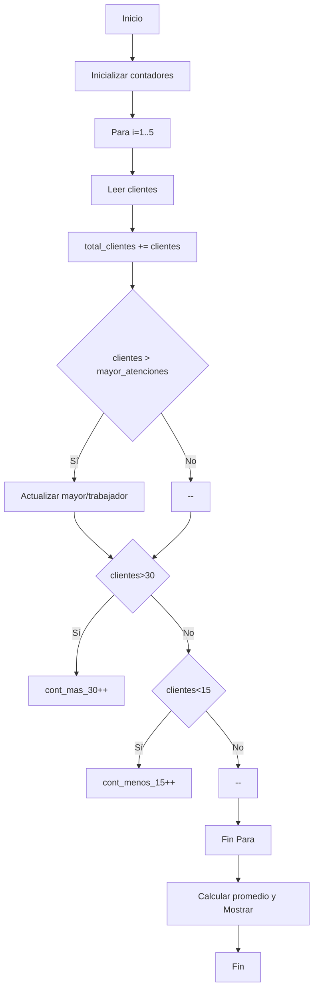
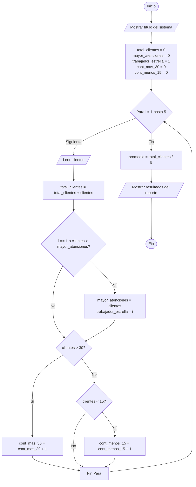

# Caso 4 - Atención al cliente

## Análisis
- Entradas: cantidad de clientes atendidos por 5 trabajadores
- Procesos: acumular total, calcular promedio, identificar trabajador con mayor atenciones, contar >30 y <15
- Salidas: total clientes, promedio, trabajador con mayor atención, conteos >30 y <15
- Variables: `clientes`, `total_clientes`, `mayor_atenciones`, `trabajador_estrella`, `cont_mas_30`, `cont_menos_15`

## Pseudocódigo
Inicio
  total_clientes = 0
  Para i = 1 Hasta 5
    Leer clientes
    total_clientes = total_clientes + clientes
    Si i==1 O clientes > mayor_atenciones Entonces actualizar mayor y trabajador_estrella
    Si clientes > 30 Entonces cont_mas_30++ SinoSi clientes < 15 Entonces cont_menos_15++ FinSi
  FinPara
  promedio = total_clientes / 5
  Mostrar resultados
Fin

## Diagrama de flujo (Mermaid)


## Código
El código Python está en `atencion_cliente.py`.
# Caso de estudio 4: Atención al cliente

> Registro y análisis de atención al cliente de 5 trabajadores utilizando simultáneamente variables, estructuras condicionales `SI-SINO`, bucles `PARA`, contadores y acumuladores, con consola optimizada.

## 1. Análisis del Problema

| Elemento | Descripción |
| :--- | :--- |
| **Problema** | Evaluar el desempeño en atención al cliente de 5 trabajadores. |
| **Entradas** | Cantidad de clientes atendidos por cada uno de los 5 trabajadores. |
| **Procesos** | - Iterar exactamente 5 veces (una por cada trabajador).<br>- Acumular el `total_clientes`.<br>- Calcular el `promedio` de clientes atendidos.<br>- Identificar al trabajador con mayor número de atenciones usando un condicional.<br>- Contar cuántos atendieron más de 30 clientes (`cont_mas_30`).<br>- Contar cuántos atendieron menos de 15 clientes (`cont_menos_15`). |
| **Salidas** | Total de clientes atendidos, promedio por trabajador, trabajador con mayor número de atenciones, número de trabajadores con >30 atenciones y número con <15 atenciones. |
| **Variables** | `clientes` (int), `total_clientes` (int), `mayor_atenciones` (int), `trabajador_estrella` (int), `cont_mas_30` (int), `cont_menos_15` (int), `promedio` (float). |

---

## 2. Pseudocódigo

```text
Inicio
    Escribir "=================================================="
    Escribir "     SISTEMA DE CONTROL DE ATENCIÓN AL CLIENTE    "
    Escribir "=================================================="
    
    total_clientes = 0
    mayor_atenciones = 0
    trabajador_estrella = 1
    cont_mas_30 = 0
    cont_menos_15 = 0
    
    Para i = 1 Hasta 5 Hacer
        Escribir "Ingrese la cantidad de clientes atendidos por el Trabajador ", i, ":"
        Leer clientes
        
        total_clientes = total_clientes + clientes
        
        Si i == 1 O clientes > mayor_atenciones Entonces
            mayor_atenciones = clientes
            trabajador_estrella = i
        FinSi
        
        Si clientes > 30 Entonces
            cont_mas_30 = cont_mas_30 + 1
        Sino
            Si clientes < 15 Entonces
                cont_menos_15 = cont_menos_15 + 1
            FinSi
        FinSi
    FinPara
    
    promedio = total_clientes / 5
    
    Escribir "=================================================="
    Escribir "       REPORTE DE ATENCIÓN AL CLIENTE        "
    Escribir "=================================================="
    Escribir " Total de clientes atendidos         : ", total_clientes
    Escribir " Promedio de atenciones por trabajador: ", promedio
    Escribir " Trabajador con mayor atención       : Trabajador ", trabajador_estrella, " (", mayor_atenciones, " clientes)"
    Escribir " Trabajadores con > 30 clientes      : ", cont_mas_30
    Escribir " Trabajadores con < 15 clientes      : ", cont_menos_15
    Escribir "=================================================="
Fin
```

---

## 3. Diagrama de Flujo



---

## 4. Código en Python (UI Mejorada)

```python
print("==================================================")
print("     SISTEMA DE CONTROL DE ATENCIÓN AL CLIENTE    ")
print("==================================================\n")

# Acumuladores, contadores y variables
total_clientes = 0
mayor_atenciones = 0
trabajador_estrella = 1
cont_mas_30 = 0
cont_menos_15 = 0

for i in range(1, 6):
    clientes = int(input(f"Ingrese la cantidad de clientes atendidos por el Trabajador {i}: "))
    
    # Acumulador
    total_clientes = total_clientes + clientes
    
    # Determinar mayor número de atenciones
    if i == 1 or clientes > mayor_atenciones:
        mayor_atenciones = clientes
        trabajador_estrella = i
        
    # Estructura SI-SINO y Contadores
    if clientes > 30:
        cont_mas_30 = cont_mas_30 + 1
    elif clientes < 15:
        cont_menos_15 = cont_menos_15 + 1
        
# Calcular promedio
promedio = total_clientes / 5

# Resultados
print("\n" + "=" * 50)
print("       REPORTE DE ATENCIÓN AL CLIENTE        ")
print("==================================================")
print(f" Total de clientes atendidos         : {total_clientes}")
print(f" Promedio de atenciones por trabajador: {promedio}")
print(f" Trabajador con mayor atención       : Trabajador {trabajador_estrella} ({mayor_atenciones} clientes)")
print(f" Trabajadores con > 30 clientes      : {cont_mas_30}")
print(f" Trabajadores con < 15 clientes      : {cont_menos_15}")
print("==================================================")
```

---

## 5. Prueba de Escritorio

**Datos de entrada de ejemplo:**
* Trabajador 1: `12` clientes
* Trabajador 2: `35` clientes
* Trabajador 3: `42` clientes
* Trabajador 4: `10` clientes
* Trabajador 5: `25` clientes

| Trabajador (`i`) | Clientes | `total_clientes` | ¿Mayor atención? (`mayor_atenciones`) | ¿Clientes > 30? (`cont_mas_30`) | ¿Clientes < 15? (`cont_menos_15`) |
| :---: | :---: | :---: | :---: | :---: | :---: |
| 1 | 12 | 12 | Sí (12, T1) | No (0) | Sí (1) |
| 2 | 35 | 47 | Sí (35, T2) | Sí (1) | No (1) |
| 3 | 42 | 89 | Sí (42, T3) | Sí (2) | No (1) |
| 4 | 10 | 99 | No (42, T3) | No (2) | Sí (2) |
| 5 | 25 | 124 | No (42, T3) | No (2) | No (2) |

**Resultados de la prueba:**
* Total de clientes: **124**
* Promedio: **124 / 5 = 24.8**
* Trabajador con mayor número de atenciones: **Trabajador 3** con **42** clientes.
* Trabajadores con > 30 clientes: **2** (Trabajadores 2 y 3).
* Trabajadores con < 15 clientes: **2** (Trabajadores 1 y 4).

---

## 6. Reto (Implementación)

El algoritmo hace uso simultáneo de los siguientes elementos solicitados:
* **Variables:** Se utilizan múltiples variables para almacenar datos (`clientes`, `total_clientes`, `promedio`, etc.).
* **SI-SINO:** Se utiliza una estructura selectiva anidada para determinar si las atenciones son mayores a 30 o menores a 15 (`Si clientes > 30 Entonces ... Sino Si clientes < 15 Entonces ...`).
* **PARA:** Se utiliza un bucle `Para i = 1 Hasta 5 Hacer` que se repite exactamente 5 veces para los 5 trabajadores.
* **Contadores:** Se utilizan las variables `cont_mas_30` y `cont_menos_15` que se incrementan en `+ 1` bajo sus respectivas condiciones.
* **Acumuladores:** Se utiliza la variable `total_clientes` que acumula el valor variable (`total_clientes = total_clientes + clientes`).
