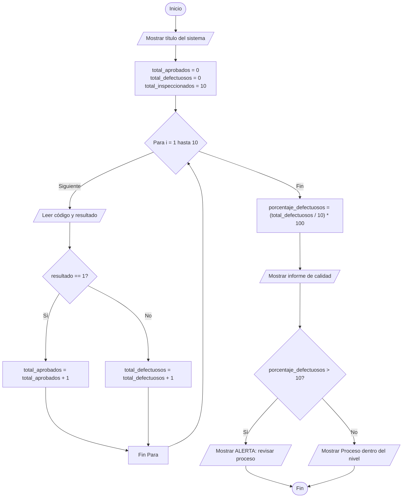

# Caso de estudio 5: Control de calidad

> Inspección de 10 productos fabricados (1 = aprobado, 0 = defectuoso) determinando totales, porcentajes de defectos y generando alertas críticas si el porcentaje supera el 10%, con consola optimizada.

## 1. Análisis del Problema

| Elemento | Descripción |
| :--- | :--- |
| **Problema** | Identificar la cantidad y porcentaje de productos defectuosos en un lote de 10 unidades, y alertar si la falla supera el 10%. |
| **Entradas** | Código del producto y resultado de inspección (`1` para aprobado, `0` para defectuoso). |
| **Procesos** | - Iterar 10 veces para ingresar la información de los productos.<br>- Usar un contador de `total_aprobados` y otro para `total_defectuosos` basados en el condicional del resultado.<br>- Calcular el `porcentaje_defectuosos` = `(total_defectuosos / 10) * 100`.<br>- Si el porcentaje > 10%, mostrar la alerta: "ALERTA: revisar proceso de producción". |
| **Salidas** | Total inspeccionados, total aprobados, total defectuosos, porcentaje de defectos y el estado de la alerta. |
| **Variables** | `total_inspeccionados` (int), `total_aprobados` (int), `total_defectuosos` (int), `codigo` (string), `resultado` (int), `porcentaje_defectuosos` (float). |

---

## 2. Pseudocódigo

```text
Inicio
    Escribir "=================================================="
    Escribir "          SISTEMA DE CONTROL DE CALIDAD           "
    Escribir "=================================================="
    
    total_aprobados = 0
    total_defectuosos = 0
    total_inspeccionados = 10
    
    Para i = 1 Hasta total_inspeccionados Hacer
        Escribir "--------------------------------------------------"
        Escribir " Inspección Producto ", i, " de ", total_inspeccionados
        Escribir "--------------------------------------------------"
        Escribir "Ingrese el código del producto:"
        Leer codigo
        Escribir "Ingrese resultado (1 = aprobado, 0 = defectuoso):"
        Leer resultado
        
        Si resultado == 1 Entonces
            total_aprobados = total_aprobados + 1
        Sino
            total_defectuosos = total_defectuosos + 1
        FinSi
    FinPara
    
    porcentaje_defectuosos = (total_defectuosos / total_inspeccionados) * 100
    
    Escribir "=================================================="
    Escribir "       INFORME FINAL DE CONTROL DE CALIDAD        "
    Escribir "=================================================="
    Escribir " Total de productos inspeccionados : ", total_inspeccionados
    Escribir " Total de productos aprobados      : ", total_aprobados
    Escribir " Total de productos defectuosos    : ", total_defectuosos
    Escribir " Porcentaje de defectuosos         : ", porcentaje_defectuosos, "%"
    Escribir "--------------------------------------------------"
    
    Si porcentaje_defectuosos > 10 Entonces
        Escribir " >> ALERTA: Revisar proceso de producción"
    Sino
        Escribir " >> PROCESO: Dentro del nivel permitido"
    FinSi
    Escribir "=================================================="
Fin
```

---

## 3. Diagrama de Flujo



---

## 4. Código en Python (UI Mejorada)

```python
print("==================================================")
print("          SISTEMA DE CONTROL DE CALIDAD           ")
print("==================================================\n")

total_aprobados = 0
total_defectuosos = 0
total_inspeccionados = 10

for i in range(1, total_inspeccionados + 1):
    print("-" * 50)
    print(f" Inspección Producto {i} de {total_inspeccionados}")
    print("-" * 50)
    codigo = input(" Código del producto : ")
    resultado = int(input(" Resultado (1=Aprobado, 0=Defectuoso): "))
            
    if resultado == 1:
        total_aprobados = total_aprobados + 1
    else:
        total_defectuosos = total_defectuosos + 1
        
# Calcular porcentaje de defectuosos
porcentaje_defectuosos = (total_defectuosos / total_inspeccionados) * 100.0

# Mostrar informe
print("\n" + "=" * 50)
print("       INFORME FINAL DE CONTROL DE CALIDAD        ")
print("==================================================")
print(f" Total de productos inspeccionados : {total_inspeccionados}")
print(f" Total de productos aprobados      : {total_aprobados}")
print(f" Total de productos defectuosos    : {total_defectuosos}")
print(f" Porcentaje de defectuosos         : {porcentaje_defectuosos}%")
print("-" * 50)

# Evaluación de estado / alerta
if porcentaje_defectuosos > 10:
    print(" >> ALERTA: Revisar proceso de producción")
else:
    print(" >> PROCESO: Dentro del nivel permitido")
print("==================================================")
```

---

## 5. Prueba de Escritorio

**Datos de prueba:**
Supongamos que en los 10 productos se obtienen los siguientes resultados de inspección:
* Productos Aprobados (resultado 1): 8 unidades.
* Productos Defectuosos (resultado 0): 2 unidades.

| Variable | Valor Esperado |
| :--- | :--- |
| `total_inspeccionados` | 10 |
| `total_aprobados` | 8 |
| `total_defectuosos` | 2 |
| `porcentaje_defectuosos` | (2 / 10) * 100 = **20%** |

**Resultado de Evaluación:**
Como el `porcentaje_defectuosos` es del **20%**, este es mayor al límite del 10%. Por lo tanto, el sistema mostrará correctamente la advertencia: 
` >> ALERTA: Revisar proceso de producción`.
