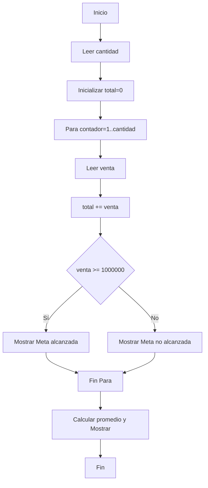

# Caso 6 - Taller práctico

## Conversión del pseudocódigo
El pseudocódigo proporcionado fue convertido a Python en `taller_practico.py`.

## Pseudocódigo (original)
Inicio
  Leer cantidad
  total = 0
  Para contador = 1 hasta cantidad
    Leer venta
    total = total + venta
    Si venta >= 1000000 Entonces Mostrar "Meta alcanzada" Sino Mostrar "Meta no alcanzada" FinSi
  FinPara
  promedio = total / cantidad
  Mostrar total, promedio
Fin

## Diagrama de flujo (Mermaid)


## Código
El código Python está en `taller_practico.py`.
# Caso de estudio 6: Taller práctico de codificación

> Conversión de pseudocódigo secuencial e iterativo a código Python ejecutable con validación de metas de ventas, con consola optimizada.

## 1. Pseudocódigo Original

El siguiente es el pseudocódigo que se entregó como base para la conversión:

```text
Inicio
    Escribir "=================================================="
    Escribir "         TALLER PRÁCTICO DE CODIFICACIÓN          "
    Escribir "=================================================="
    Escribir "Ingrese la cantidad:"
    Leer cantidad

    total = 0

    Para contador = 1 hasta cantidad
        Leer venta
        total = total + venta

        Si venta >= 1000000 Entonces
            Mostrar "Meta alcanzada"
        Sino
            Mostrar "Meta no alcanzada"
        FinSi
    FinPara

    Si cantidad > 0 Entonces
        promedio = total / cantidad
    Sino
        promedio = 0
    FinSi

    Escribir "=================================================="
    Escribir "             RESULTADOS FINALES                   "
    Escribir "=================================================="
    Escribir " Total general de ventas : $", total
    Escribir " Promedio de ventas      : $", promedio
    Escribir "=================================================="
Fin
```

---

## 2. Análisis de la Traducción

Para trasladar este algoritmo al lenguaje Python, se deben tener en cuenta las siguientes correspondencias de sintaxis:

| Pseudocódigo | Sintaxis en Python |
| :--- | :--- |
| `Leer cantidad` | `cantidad = int(input("Ingrese la cantidad: "))` |
| `Para contador = 1 hasta cantidad` | `for contador in range(1, cantidad + 1):` |
| `total = total + venta` | `total += venta` |
| `Si venta >= 1000000 Entonces` | `if venta >= 1000000:` |
| `Sino` | `else:` |
| `Mostrar "Texto"` | `print("Texto")` |

> En la traducción a Python, para evitar la división por cero cuando `cantidad` es 0, es una excelente práctica validar mediante un condicional que `cantidad > 0` antes de calcular el promedio.

---

## 3. Código Traducido a Python (UI Mejorada)

```python
print("==================================================")
print("         TALLER PRÁCTICO DE CODIFICACIÓN          ")
print("==================================================\n")

cantidad = int(input("Ingrese la cantidad de ventas a procesar: "))
print("-" * 50)

total = 0.0

for contador in range(1, cantidad + 1):
    venta = float(input(f"Ingrese la venta {contador}: $"))
    total = total + venta
    
    if venta >= 1000000:
        print("  -> Meta alcanzada")
    else:
        print("  -> Meta no alcanzada")
        
if cantidad > 0:
    promedio = total / cantidad
else:
    promedio = 0.0

print("\n" + "=" * 50)
print("             RESULTADOS FINALES                   ")
print("==================================================")
print(f" Total general de ventas : ${total}")
print(f" Promedio de ventas      : ${promedio}")
print("==================================================")
```

---

## 4. Prueba de Escritorio

**Datos de prueba:**
* `cantidad`: 3
* `venta 1`: $900.000
* `venta 2`: $1.200.000
* `venta 3`: $850.000

| Iteración | Venta Ingresada | `total` (Acumulador) | ¿Venta >= 1.000.000? | Salida en Consola (Ciclo) |
| :---: | :---: | :---: | :---: | :--- |
| Inicial | - | 0 | - | - |
| 1 | $900.000 | 900.000 | Falso | `Meta no alcanzada` |
| 2 | $1.200.000 | 2.100.000 | Verdadero | `Meta alcanzada` |
| 3 | $850.000 | 2.950.000 | Falso | `Meta no alcanzada` |

**Cálculos Finales:**
* `total`: **$2.950.000**
* `promedio`: $2.950.000 / 3 = **$983.333,33...**
